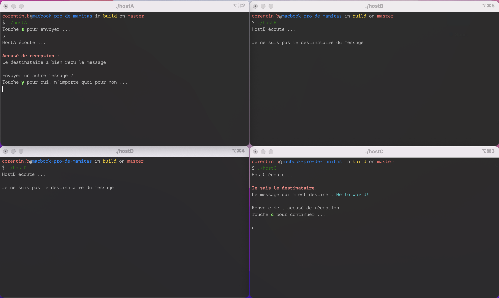

# UDP Token Ring

### Introduction
Création d'un anneau à sens unique avec 4 hôtes.
Les hôtes sont virtuels et échangent via la boucle locale en mode non connecté (UDP).
Implémentation du protocole qui est décrit dans le fichier ***protocole.pdf*** .

*Voici le cas qui sert d'exemple dans le protocole :*

*HostA veut envoyer un message à HostC. Pour cela, l'HostA émet une trame sur la structure de l'anneau. HostB reçoit la trame, il vérifie que cette trame lui est destinée, sinon, il continue de la faire circuler. La trame arrive finalement à HostC, ce dernier lit le message puis envoie un accusé de réception vers l'hôte source. Ainsi, HostA est capble de savoir si son message a bien été transmis. Une fois que cette première trame a finit de circuler, chaque Host est libre d'envoyer un nouveau message ou non.*

### Compilation
Première compilation du projet :
```
mkdir build
cd build/
cmake ..
make
```

Une fois que le répertoire ***build*** est créé et que vous voulez recompiler, vous pouvez simplement faire :
```
cd build/ ; cmake .. ; make clean ; make
```

### Fonctionnement 
Lancez 4 terminaux :
```
./hostA
./hostB
./hostC
./hostD
```


### Bug
Lorsqu'on intéragit avec le terminal, veuillez faire attention à ce que votre message ne comporte pas d'espace, sinon, ce dernier est tronqué au premier espace.